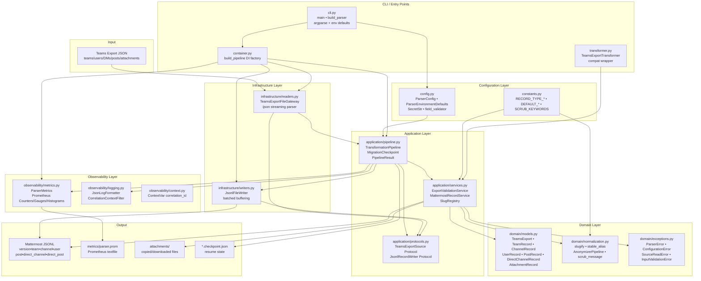

# ARCHITECTURE REVIEW
## Teams → Mattermost Migration Platform
**Audit Date:** 2026-06-08  
**Reviewer Role:** Staff Software Engineer / Principal SRE

---

## System Architecture Overview



---

## Layer 1: Domain Layer

### Purpose
Encodes the business concepts of the migration domain in immutable, validated Python types. Has zero dependencies on infrastructure or application concerns.

### Components

**`domain/models.py`** — 63 lines, 7 classes  
All models extend `ImmutableModel(BaseModel)` with `ConfigDict(extra="forbid", frozen=True)`:
- `AttachmentRecord`: `name`, `path`, `url|None`
- `PostRecord`: `username`, `message`, `timestamp_ms(≥0)`, `id|None`, `parent_id|None`, `attachments:tuple`
- `ChannelRecord`: `name`, `display_name`, `is_private`, `posts`, `members`, `owners`
- `TeamRecord`: `name`, `display_name`, `description`, `channels`, `members`, `owners`
- `UserRecord`: `username`, `email:EmailStr`, `nickname`, `teams`
- `DirectChannelRecord`: `members`, `posts`
- `TeamsExport`: `teams`, `users`, `direct_channels`

**Design Decisions:**
- `frozen=True` prevents accidental mutation after parse
- `extra="forbid"` rejects unknown fields, preventing silently-ignored data
- `tuple` rather than `list` for nested collections enforces immutability
- `EmailStr` from pydantic[email] validates email format at parse time

**`domain/normalization.py`** — 83 lines  
Pure functions with no side effects, testable in isolation.

**`domain/exceptions.py`** — 20 lines  
Clean exception hierarchy: `ParserError → {ConfigurationError, SourceReadError, InputValidationError}`

### Assessment
- **Purity:** ✅ Zero infrastructure imports
- **Immutability:** ✅ `frozen=True` + `tuple` collections
- **Validation:** ✅ Pydantic v2 with email validation
- **Extensibility:** ✅ Add new record types by adding a new `ImmutableModel` subclass

---

## Layer 2: Application Layer

### Purpose
Coordinates domain objects, applies business rules, and orchestrates the transformation workflow. Depends only on domain layer and protocols (not infrastructure).

### Components

**`application/protocols.py`** — 41 lines  
Two `Protocol` interfaces using structural subtyping:
- `TeamsExportSource`: `iter_teams()`, `iter_users()`, `iter_direct_channels()`, `input_size_bytes()`, `materialize()`
- `JsonlRecordWriter`: `write_record()`, `flush()`, `close()`

This is the **dependency inversion** boundary — application code depends on abstractions, not `TeamsExportFileGateway` or `JsonlFileWriter` directly.

**`application/services.py`** — 685 lines  
Three services:
1. `SlugRegistry`: collision-free slug allocation with `_used: set[str]` and suffix counter
2. `ExportValidationService`: pre-flight validation, collects up to 20 errors before raising
3. `MattermostRecordService`: transformation engine — builds slug mappings, resolves memberships, renders all 7 record types, handles attachments with retry

**`application/pipeline.py`** — 283 lines  
- `MigrationCheckpoint`: JSON-backed state machine for crash/resume
- `TransformationPipeline`: orchestrates validation → render → write with metrics timing, error handling, and checkpoint lifecycle

### Architectural Patterns
- **Iterator/Generator pattern:** All `iter_*` methods yield records lazily — no full materialization
- **Dependency Injection:** `TransformationPipeline.__init__` accepts `source`, `writer`, `validator`, `record_service`, `metrics` — all swappable via protocol
- **Strategy pattern:** `TeamsExportSource` protocol allows in-memory, file-based, or future streaming sources to be used interchangeably
- **Command pattern:** `TransformationPipeline.run()` is an idempotent command with documented preconditions

### Assessment
- **Separation of Concerns:** ✅ Business logic isolated from I/O
- **Testability:** ✅ All 12 unit tests use in-memory source/writer stubs
- **Protocol Compliance:** ✅ mypy verifies structural compatibility
- **Size:** ⚠️ `services.py` at 685 lines is approaching complexity threshold. Candidate for decomposition into `UserRecordRenderer`, `PostRecordRenderer`, `AttachmentProcessor`.

---

## Layer 3: Infrastructure Layer

### Purpose
Implements the protocol interfaces defined in the application layer using concrete I/O operations.

### Components

**`infrastructure/readers.py`** — 71 lines  
`TeamsExportFileGateway`: Uses `ijson.items(handle, prefix)` for constant-memory streaming JSON parse. Implements `TeamsExportSource` structurally. Error mapping: `ValidationError → InputValidationError`, `json.JSONDecodeError → SourceReadError`, `OSError → SourceReadError`, `ijson.JSONError → SourceReadError`.

**`infrastructure/writers.py`** — 47 lines  
`JsonlFileWriter`: Buffers records in `list[str]`, flushes with a single `write()` call per `batch_size` records. Opens file in `"w"` or `"a"` mode based on `append` flag. Exposes `has_existing_content` property for resume detection.

### Architecture Gap
The `materialize()` method in `TeamsExportFileGateway` (readers.py:41–46) performs **3 sequential full-file scans** to build a `TeamsExport` aggregate. The streaming `iter_*` methods each independently re-open and re-scan the file. This means a full pipeline run does **6 file reads** (3 for validation pass, 3 for render pass). For typical enterprise exports (< 100MB), this is acceptable. For multi-GB exports, this is a scalability bottleneck.

### Assessment
- **Memory efficiency:** ✅ ijson streaming prevents OOM on large files
- **Error propagation:** ✅ Clean mapping to domain exceptions
- **Batch efficiency:** ✅ Configurable batch_size reduces syscall overhead
- **Multi-pass penalty:** ⚠️ 6 file reads per pipeline run

---

## Layer 4: Observability Layer

### Purpose
Provide structured logging, Prometheus metrics, and correlation context for production monitoring.

### Components

**`observability/context.py`** — 14 lines  
`ContextVar[str]` for async-safe correlation ID propagation. Used by `CorrelationContextFilter`.

**`observability/logging.py`** — 56 lines  
`JsonLogFormatter`: Single-line JSON logs with `timestamp`, `level`, `logger`, `service`, `correlation_id`, `message`, and optional structured `event`/`details` fields. Compatible with Loki/ELK structured log ingestion.

**`observability/metrics.py`** — 106 lines  
`ParserMetrics`: Isolated `CollectorRegistry` (avoids global state contamination in tests). 9 metrics covering runs, records, stage durations, bytes, throughput, failures, attachments, checkpoint resumes. Published to textfile (Prometheus textfile_collector) and/or Pushgateway.

### Prometheus Alert Rules (monitoring/prometheus/rules/migration-platform-alerts.yml)
- `MattermostUnavailable`: `up{job="mattermost"} == 0` for 5m → CRITICAL
- `ParserRunFailure`: `increase(tmmp_parser_runs_total{status="failed"}[15m]) > 0` → WARNING  
- `ParserThroughputDegraded`: `tmmp_parser_records_per_second < 1` for 10m → WARNING

### Observability Stack
```
Parser → prom textfile → Prometheus scrape (pushgateway)
Parser → stdout JSON → Promtail → Loki → Grafana
Mattermost → :8067 → Prometheus scrape
PostgreSQL → postgres-exporter → Prometheus scrape
Containers → cadvisor → Prometheus scrape
```

### Assessment
- **Structured Logging:** ✅ JSON with correlation IDs
- **Metrics Coverage:** ✅ 9 Prometheus metrics
- **Alert Rules:** ✅ 3 actionable alerts
- **Trace Integration:** ❌ **GAP** — No OpenTelemetry spans. `otel_service_name` field is collected but no OTEL exporter is implemented. Distributed tracing is not functional.

---

## Layer 5: Deployment Layer

### Docker Deployment

**`apps/parser/Dockerfile`** — 35 lines  
Multi-stage build:
1. `builder` stage: Python 3.12-slim, installs `build`, runs `python -m build --wheel`
2. `runtime` stage: Python 3.12-slim, creates non-root user `parser:65532`, installs wheel, sets `ENTRYPOINT ["tmmp-parser"]`

Security posture: non-root user, `read_only: true` filesystem in compose, `no-new-privileges:true` security_opt.

**`infrastructure/docker/docker-compose.yml`** — 145 lines  
Services: `postgres`, `mattermost`, `parser` (profile: `tooling`)  
Networks: `platform` (bridge) + `data` (bridge, internal: true)  
Mattermost runs as `user: "2000:2000"` (non-root).  
Resource limits: postgres 768M/1CPU, mattermost 2G/2CPU.  
Healthchecks: pg_isready for postgres, wget health probe for mattermost.

**`infrastructure/docker/docker-compose.monitoring.yml`** — 101 lines  
Services: `prometheus`, `loki`, `promtail`, `grafana`, `cadvisor`, `postgres-exporter`, `pushgateway`  
Note: `cadvisor` uses `privileged: true` — required for container metrics but increases attack surface.

### Kubernetes Deployment

**`infrastructure/kubernetes/base/`** — 6 manifest files:
- `namespace.yaml`: `teams-mattermost-migration` namespace
- `serviceaccount.yaml`: `parser-runner` ServiceAccount
- `configmap.yaml`: `parser-config` ConfigMap
- `parser-job.yaml`: `batch/v1 Job` with `backoffLimit: 3`, non-root security context, `RuntimeDefault` seccomp profile
- `networkpolicy.yaml`: Egress restricted to TCP 5432 (PostgreSQL), 6379 (Redis), 443 (HTTPS)
- `kustomization.yaml`: references all 6 resources

**Overlays:**
- `local/`: lighter resource requests (250m CPU, 256Mi RAM)
- `staging/`: heavier resource requests (500m CPU, 512Mi RAM)

### Deployment Gap
- No `PodDisruptionBudget` for Mattermost
- No `HorizontalPodAutoscaler` (parser is a Job, appropriate)
- Parser Job uses `imagePullPolicy: IfNotPresent` with tag `latest` — this is **dangerous in production** as `latest` is mutable
- No `readinessProbe`/`livenessProbe` in the Job container (not applicable for batch Jobs — acceptable)
- Kubernetes Helm chart directory exists but appears empty (`infrastructure/kubernetes/helm/`)

### Assessment
- **Docker Security:** ✅ Non-root, read-only filesystem, seccomp
- **K8s Security:** ✅ Non-root, seccomp RuntimeDefault, NetworkPolicy
- **Resource Limits:** ✅ Both requests and limits defined
- **Image Tagging:** ⚠️ `latest` tag in base Job spec — use digest pinning in production
- **Helm Chart:** ❌ **GAP** — `helm/` directory exists but contains no chart files

---

## Layer 6: CI/CD Layer

### CI Pipeline (`.github/workflows/ci.yml`)
4 parallel jobs:
1. **`python`**: Matrix (3.11 + 3.12) — ruff lint, ruff format, mypy, pytest with coverage
2. **`shell-and-config`**: shellcheck, shfmt, yamllint, markdownlint
3. **`docker-compose`**: validate core + monitoring compose, build parser image
4. **`kubernetes`**: kustomize local + staging overlays, kubeconform strict validation

### Security Pipeline (`.github/workflows/security.yml`)
3 jobs:
1. **`dependency-audit`**: pip-audit for runtime + dev dependencies (weekly + on push)
2. **`gitleaks`**: Secret scanning across full git history
3. **`trivy-and-sbom`**: Filesystem scan → SARIF uploaded to GitHub Code Scanning; SBOM generated via Syft in SPDX-JSON format

### Release Pipeline (`.github/workflows/release.yml`)
- `googleapis/release-please-action@v4` — automated semantic versioning and changelog generation from conventional commits

### Dependency Management
- **Dependabot**: Weekly updates for GitHub Actions, root pip, and `apps/parser` pip dependencies. Major version updates ignored (safe policy).

### PR Quality
- `amannn/action-semantic-pull-request@v5` enforces Conventional Commits format on PR titles.

### CI/CD Assessment
- **Quality Gates:** ✅ lint + typecheck + test + coverage must pass before merge
- **Security Scanning:** ✅ Trivy SARIF + Gitleaks + pip-audit
- **Release Automation:** ✅ Conventional Commits → automated CHANGELOG + version bump
- **Matrix Testing:** ✅ Python 3.11 + 3.12
- **Missing:** ❌ No container image publish job (no GHCR push after successful CI)
- **Missing:** ❌ No staging deployment job triggered by release

---

## Quality Dimension Assessments

| Dimension | Score | Evidence |
|-----------|-------|----------|
| **Scalability** | 7/10 | ijson streaming ✅, but 6-pass file reads ⚠️, no parallelism |
| **Reliability** | 7/10 | Checkpoint/resume ✅, healthchecks ✅, retry ✅, atomic checkpoint ❌ |
| **Security** | 8/10 | Non-root Docker ✅, SecretStr ✅, pip-audit clean ✅, SSL validation gap ⚠️ |
| **Maintainability** | 8/10 | Clean layering ✅, mypy strict ✅, services.py 685L at complexity threshold |
| **Readability** | 9/10 | Excellent docstrings, typed signatures throughout, consistent naming |
| **Testability** | 9/10 | DI via protocols, in-memory stubs, 90.03% coverage, 28 passing tests |
| **Extensibility** | 8/10 | Protocol interfaces allow new sources/writers, exception hierarchy clean |
| **Operational Excellence** | 7/10 | Prometheus metrics ✅, Grafana dashboards ✅, OTEL not implemented ❌ |
