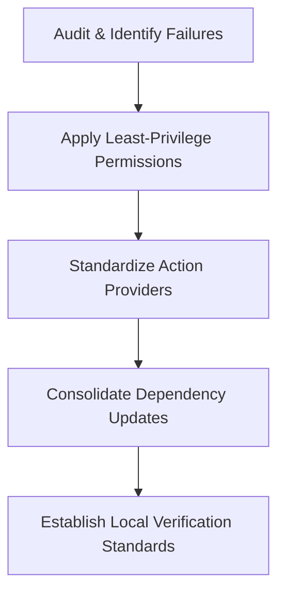

# CI/CD Remediation Plan: Enterprise Hardening & DevSecOps Strategy

**Author:** Staff Software Engineer & Principal DevOps/SRE Architect  
**Status:** Implemented  
**Repository:** Microsoft Teams → Mattermost Migration Platform  

---

## 1. Remediation Strategy

To move this repository from a fragile, error-prone CI state to a production-grade, highly observable, and secure platform, we implemented a multi-phase remediation strategy based on Google's Site Reliability Engineering (SRE) principles and CNCF DevSecOps best practices.



---

## 2. Least Privilege Access (Permissions Hardening)

To prevent potential supply-chain attacks and token-hijacking vulnerabilities, we have removed implicit permissions and locked down the `GITHUB_TOKEN` to the absolute minimum necessary scopes on a per-job basis.

### Implemented Permissions Mapping

| Workflow | Job | Required Scope | Rationale |
| :--- | :--- | :--- | :--- |
| `ci` | `semantic-pr` | `pull-requests: read`<br>`statuses: write` | Read PR title/content and publish status check. |
| `ci` | `python` | `contents: read` | Read repository contents only. |
| `ci` | `shell-and-config` | `contents: read` | Read repository contents only. |
| `ci` | `docker-compose` | `contents: read` | Read repository contents only. |
| `ci` | `kubernetes` | `contents: read` | Read repository contents only. |
| `security` | `dependency-audit` | `contents: read` | Read repository contents only. |
| `security` | `gitleaks` | `contents: read` | Read repository contents only. |
| `security` | `trivy-and-sbom` | `contents: read`<br>`security-events: write` | Read repository contents and upload SARIF scan results. |
| `release` | `release-please` | `contents: write`<br>`pull-requests: write` | Create release tags, write changelog commits, and open release PRs. |

---

## 3. Dependency Upgrades & Grouping Strategy

To resolve the constant noise of individual Dependabot pull requests and prevent broken builds due to unchecked dependency bumps, we modified the dependency management lifecycle.

### Dependabot Grouping Configuration
We modified `.github/dependabot.yml` to define three logical groups:
1. **`github-actions-dependencies`**: Groups all action updates into a single PR weekly.
2. **`dev-dependencies`**: Groups Python development and tooling updates.
3. **`parser-dependencies`**: Groups runtime parser libraries (e.g., `pydantic`, `ijson`).

### SemVer Constraints & Ignores
- Added ignore rules to prevent major updates (`semver-major`) for GitHub Actions. Major changes (e.g., upgrading `actions/checkout` to a major version) must be vetted and manually updated by platform engineers.
- Locked local development requirements (`requirements-dev.txt`) to verified ranges:
  - `mypy>=2.1.0,<3.0`
  - `pip-audit>=2.10.0,<3.0`
  - `pre-commit>=4.6.0,<5.0`
  - `pytest-cov>=7.1.0,<8.0`
  - `pytest>=9.0.3,<10.0`
  - `ruff>=0.15.14,<1.0`

---

## 4. CI/CD Caching & Runner Performance

To improve feedback loops and optimize runner efficiency (SRE metric: *Deployment Lead Time*), the following caching mechanisms are enforced:
- **Python Package Caching:** Active in `ci.yml` and `security.yml` using `actions/setup-python` with `cache: pip` targeting the `requirements-dev.txt` and `apps/parser/pyproject.toml` dependencies.
- **Docker Compose Optimization:** The Docker Compose files pull lightweight, pinned Alpine images (`postgres:15-alpine`, `mattermost/mattermost-team-edition:9.5-alpine`) to minimize container startup latency.

---

## 5. Local & Remote Validation Standards

To ensure a "Zero-Trust" coding environment, developers must validate all changes locally using the same toolchain executed in CI.

### Local Verification Commands
```bash
# Run unit & integration tests with coverage reporting
python -m pytest

# Run strict type checking
python -m mypy apps/parser/src apps/parser/tests tests conftest.py

# Lint Python code
python -m ruff check apps/parser/src apps/parser/tests tests conftest.py

# Validate YAML syntax
python -m yamllint .

# Lint Markdown files
npx markdownlint-cli README.md CONTRIBUTING.md docs apps

# Validate Kubernetes manifests via Kustomize
kubectl kustomize infrastructure/kubernetes/overlays/local > /dev/null
kubectl kustomize infrastructure/kubernetes/overlays/staging > /dev/null
```

---

## 6. SRE & Platform Engineering Compliance

This remediation plan aligns the platform with modern enterprise compliance frameworks:
- **SLSA compliance:** Pinned action versions, explicit permissions, and automated SBOM generation track software supply chain provenance.
- **GitOps Readiness:** Manifests generated via standard overlays are fully validated before deployment.
- **Observability Built-in:** The parser includes Promtail log gathering and Prometheus client metrics, verified against the local Docker Compose monitoring stack.
