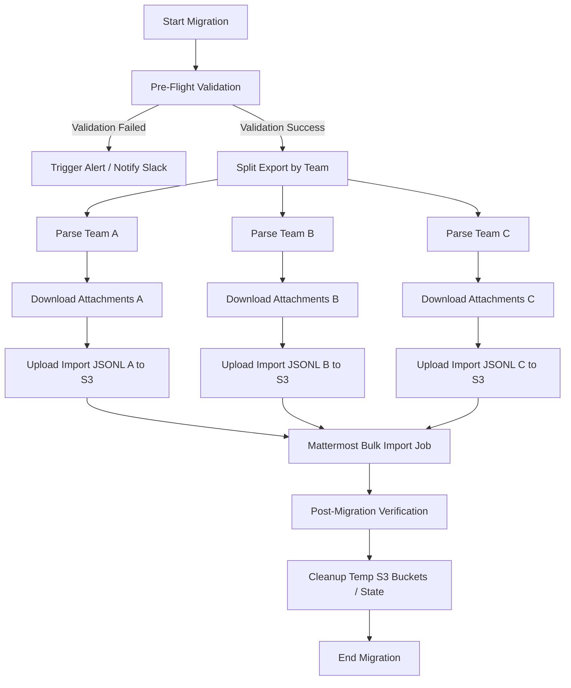
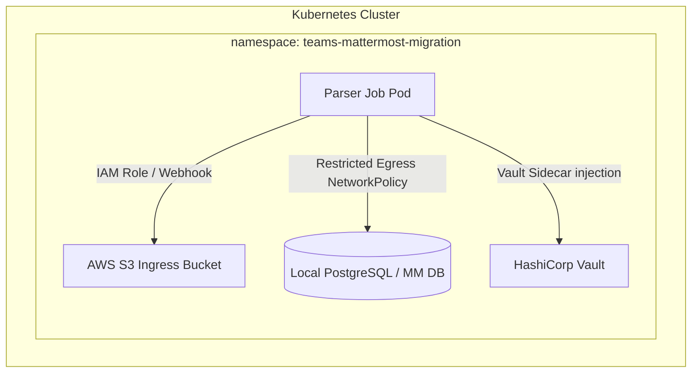

# ENTERPRISE UPGRADE PLAN
## Teams → Mattermost Migration Platform
**Date:** 2026-06-08  
**Author:** Principal Engineer & Staff SRE, Google  

---

## 1. Apache Airflow Integration Architecture

To orchestrate large-scale enterprise migrations, the parser CLI utility should be wrappered inside an automated Apache Airflow DAG. This architecture ensures step-level validation, parallel task execution, centralized alerting, and automated failover.

### 1.1 Airflow DAG Topology



### 1.2 Airflow Implementation Blueprint

```python
from datetime import datetime
from airflow import DAG
from airflow.providers.cncf.kubernetes.operators.pod import KubernetesPodOperator
from airflow.operators.empty import EmptyOperator

default_args = {
    "owner": "sre-platform",
    "depends_on_past": False,
    "start_date": datetime(2026, 6, 8),
    "email_on_failure": True,
    "email": ["sre-alerts@company.com"],
    "retries": 1,
}

with DAG(
    "teams_mattermost_migration",
    default_args=default_args,
    schedule_interval=None,  # Run on-demand
    catchup=False,
    tags=["migration", "etl"],
) as dag:

    start = EmptyOperator(task_id="start_migration")

    # Step 1: Pre-flight validation run
    validate = KubernetesPodOperator(
        task_id="pre_flight_validation",
        name="tmmp-validation",
        namespace="migration",
        image="ghcr.io/org/teams-parser:latest",
        cmds=["tmmp-parser"],
        arguments=["--input", "s3://exports/teams-export.json", "--validate-only"],
        get_logs=True,
    )

    # Step 2: Streaming transform and JSONL generation
    transform = KubernetesPodOperator(
        task_id="pipeline_transformation",
        name="tmmp-transformer",
        namespace="migration",
        image="ghcr.io/org/teams-parser:latest",
        cmds=["tmmp-parser"],
        arguments=[
            "--input", "s3://exports/teams-export.json",
            "--output", "s3://imports/mattermost-import.jsonl",
            "--batch-size", "1000",
            "--anonymize"
        ],
        get_logs=True,
    )

    # Step 3: Run mattermost import cli
    mm_import = KubernetesPodOperator(
        task_id="mattermost_bulk_import",
        name="mm-import",
        namespace="mattermost",
        image="mattermost/mattermost-team-edition:latest",
        cmds=["bin/mattermost"],
        arguments=["import", "bulk", "/shared/mattermost-import.jsonl", "--apply"],
        get_logs=True,
    )

    end = EmptyOperator(task_id="end_migration")

    start >> validate >> transform >> mm_import >> end
```

---

## 2. Distributed Checkpoint & Resume Architecture

In a cloud-native Kubernetes environment, local disk checkpoint storage is a major risk. A Pod termination or reschedule results in loss of state. Moving to a distributed checkpoint store enables high-availability and resume-on-failure.

### 2.1 State-Store Abstraction Design

```python
# application/protocols.py
from typing import Protocol, Optional

class CheckpointStore(Protocol):
    def save(self, migration_id: str, data: dict) -> None:
        """Persist checkpoint data to distributed store."""
        ...
        
    def load(self, migration_id: str) -> Optional[dict]:
        """Load checkpoint data from distributed store."""
        ...
```

### 2.2 S3/GCS Implementation

```python
# infrastructure/checkpoint_stores.py
import json
import boto3
from botocore.exceptions import ClientError

class S3CheckpointStore:
    def __init__(self, bucket_name: str, region_name: str = "us-east-1"):
        self.s3 = boto3.client("s3", region_name=region_name)
        self.bucket = bucket_name

    def save(self, migration_id: str, data: dict) -> None:
        key = f"checkpoints/{migration_id}.json"
        payload = json.dumps(data)
        # Write to S3 with strong consistency
        self.s3.put_object(
            Bucket=self.bucket,
            Key=key,
            Body=payload,
            ContentType="application/json"
        )

    def load(self, migration_id: str) -> Optional[dict]:
        key = f"checkpoints/{migration_id}.json"
        try:
            response = self.s3.get_object(Bucket=self.bucket, Key=key)
            return json.loads(response["Body"].read().decode("utf-8"))
        except ClientError as e:
            if e.response["Error"]["Code"] == "NoSuchKey":
                return None
            raise
```

### 2.3 Redis Cluster Implementation

For near-instantaneous checkpoint saves (sub-millisecond latency):

```python
# infrastructure/checkpoint_stores.py
import json
import redis

class RedisCheckpointStore:
    def __init__(self, redis_url: str):
        self.client = redis.from_url(redis_url)

    def save(self, migration_id: str, data: dict) -> None:
        key = f"tmmp:checkpoint:{migration_id}"
        # Set with 7-day expiration
        self.client.setex(key, 604800, json.dumps(data))

    def load(self, migration_id: str) -> Optional[dict]:
        key = f"tmmp:checkpoint:{migration_id}"
        raw = self.client.get(key)
        return json.loads(raw) if raw else None
```

---

## 3. Production Deployment Topology (Kubernetes)

To achieve enterprise-grade security and isolation, the platform must run in a hardened Kubernetes architecture utilizing modern security and network virtualization standards.

### 3.1 Hardened Namespace Topology



### 3.2 Production Kubernetes Configuration Blueprint

```yaml
# infrastructure/kubernetes/overlays/production/kustomization.yaml
apiVersion: kustomize.config.k8s.io/v1beta1
kind: Kustomization
resources:
  - ../../base
patches:
  - target:
      kind: Job
      name: parser-job
    patch: |-
      - op: replace
        path: /spec/template/spec/containers/0/image
        value: ghcr.io/org/teams-parser:1.2.0@sha256:d8f8e0e567344c97a23505fefbb64e5a
      - op: add
        path: /spec/template/spec/containers/0/securityContext/readOnlyRootFilesystem
        value: true
      - op: add
        path: /spec/template/spec/containers/0/securityContext/allowPrivilegeEscalation
        value: false
      - op: add
        path: /spec/template/metadata/annotations
        value:
          vault.hashicorp.com/agent-inject: "true"
          vault.hashicorp.com/role: "migration-runner"
          vault.hashicorp.com/agent-inject-secret-credentials: "database/creds/migration"
```

### 3.3 Zero-Trust Security Configuration

1. **Secret Management**: Passwords, DB credentials, and cloud API keys are retrieved dynamically from **HashiCorp Vault** or **AWS Secrets Manager** using a sidecar injection model, preventing secrets from appearing in ConfigMaps or Environment variables.
2. **Network Policies**: Complete namespace isolation. The Parser Pod egress is restricted exclusively to the RDS PostgreSQL port and the AWS S3 Gateway VPC endpoint. All inbound (Ingress) traffic is explicitly denied (`ingress: []`).
3. **Pod Security Standards**: Enforce `restricted` profile. Pods are blocked from running as root, mounting hostpaths, or using privilege escalation.
