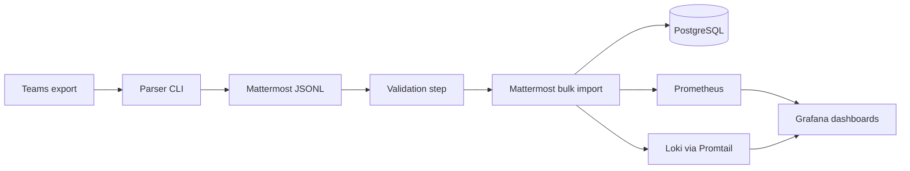

# Teams to Mattermost Migration Platform

This repository is a production-style platform engineering project for transforming
Microsoft Teams export data, validating Mattermost bulk import payloads, running
controlled imports, and operating the platform with SRE-friendly tooling.

The repo is designed to look and behave like an internal platform onboarding project:

- clear separation between application code, infrastructure, scripts, and docs
- deterministic local workflows with Docker Compose
- observability-first defaults with Prometheus, Grafana, Loki, and Promtail
- a migration path from local containers to Kubernetes batch execution
- typed Python transformation code and testable shell automation

## Repository layout

```text
.
|-- apps/
|   `-- parser/
|-- infrastructure/
|   |-- docker/
|   |-- kubernetes/
|   `-- monitoring/
|-- scripts/
|   |-- bootstrap/
|   |-- cleanup/
|   |-- migration/
|   |-- monitoring/
|   `-- verification/
|-- docs/
|   |-- architecture/
|   |-- observability/
|   |-- operations/
|   |-- runbooks/
|   |-- security/
|   `-- troubleshooting/
`-- tests/
```

## Quick start

1. Bootstrap the workspace.

```bash
make bootstrap
make install-dev
make pre-commit-install
```

1. Start the platform.

```bash
make up
```

1. Generate an import payload from the sample fixture.

```bash
make transform
```

1. Validate and apply the payload.

```bash
make validate
make apply
```

1. Start observability services when you want dashboards and logs.

```bash
make monitoring-up
```

Service endpoints:

- Mattermost: `http://localhost:8065`
- Grafana: `http://localhost:3000`
- Prometheus: `http://localhost:9090`
- Loki: `http://localhost:3100`

## Core workflows

- `make health` verifies Docker, PostgreSQL, Mattermost, and HTTP readiness.
- `make verify` runs PostgreSQL table-count verification after imports.
- `make reset` removes local state, volumes, and generated payloads.
- `make typecheck` runs strict mypy checks.
- `make coverage` runs the full test suite with coverage reporting.
- `make security` runs dependency audit checks.
- `make lint` validates Python, shell scripts, YAML, Markdown, and Docker Compose manifests.
- `make test` runs unit, integration, and repository contract tests.

## Architecture summary



The local stack is intentionally small, but the structure anticipates future
platform concerns such as Redis-backed coordination, object storage for large
payloads, queue-driven workers, and Kubernetes job execution.

## Documentation

- `docs/architecture/overview.md`
- `docs/operations/onboarding.md`
- `docs/operations/deployment.md`
- `docs/observability/stack.md`
- `docs/security/hardening.md`
- `docs/runbooks/migration-execution.md`
- `docs/runbooks/incident-response.md`
- `docs/troubleshooting/common-failures.md`

## Developer experience

- `apps/parser/` contains the typed parser application and unit tests.
- `scripts/` contains the operator entrypoints, grouped by lifecycle stage.
- `tests/fixtures/` contains a normalized sample export used by local runs and CI.
- `infrastructure/kubernetes/` contains Kustomize scaffolding for batch-style cluster execution.
- `.github/workflows/` contains CI, security, and release automation.
