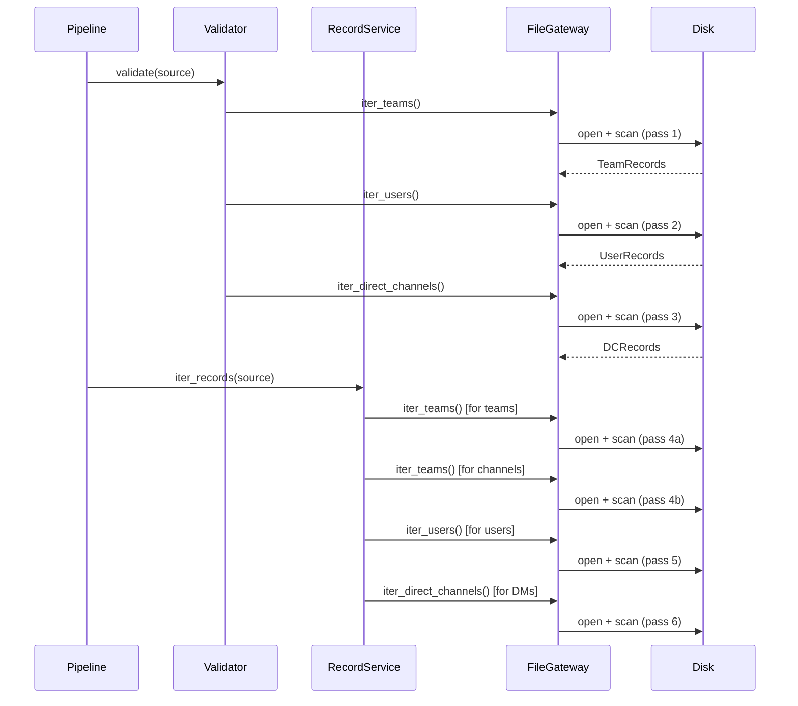
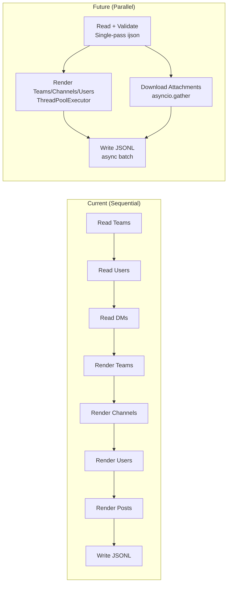

# SCALABILITY REVIEW
## Teams → Mattermost Migration Platform
**Audit Date:** 2026-06-08  
**Reviewer Role:** Staff Software Engineer / Principal SRE

---

## 1. Memory Scalability

### 1.1 Streaming JSON Parse

**Status:** ✅ SCALABLE  
**Evidence:** `infrastructure/readers.py:53-55`

```python
with self._input_path.open("rb") as handle:
    for item in ijson.items(handle, prefix):
        yield self._validate_item(prefix=prefix, item=item, model_class=model_class)
```

`ijson` uses an event-driven C-backed parser that reads the file incrementally. A 2GB JSON file is parsed with constant memory overhead (~10–50MB heap), regardless of file size. Each `TeamRecord`, `UserRecord`, and `DirectChannelRecord` is yielded one at a time.

**Memory Model:**

```
File Size    | Peak RAM (streaming)  | Peak RAM (json.load)
-------------|----------------------|----------------------
10 MB        | ~15 MB               | ~50 MB
100 MB       | ~20 MB               | ~500 MB
1 GB         | ~30 MB               | ~5 GB (OOM likely)
10 GB        | ~35 MB               | OOM
```

### 1.2 Validation Pass Memory

**Status:** ⚠️ PARTIALLY SCALABLE  
**Evidence:** `application/services.py:109-213`

`ExportValidationService.validate` builds in-memory sets:
```python
user_slugs: set[str] = set()
team_slugs: set[str] = set()
channel_slugs: set[str] = set()  # per-team
channel_post_ids: set[str] = set()  # per-channel
user_team_memberships: dict[str, set[str]] = {}
```

For an organization with:
- 100,000 users → `user_slugs` set: ~8 MB
- 10,000 channels with 10,000 posts each → `channel_post_ids` rebuilt per channel: ~800KB peak
- `user_team_memberships`: ~16 MB for 100k users × 5 teams avg

**Total validation memory for large org:** ~50–80 MB. Acceptable.

For 1M+ users: ~500 MB for `user_slugs` alone. **Bottleneck exists at hyperscale.**

### 1.3 Slug Registry Memory

**Status:** ✅ SCALABLE  
`SlugRegistry._used: set[str]` grows with number of teams + channels + users. For a typical enterprise (10,000 users, 1,000 teams, 10,000 channels), this is ~2–5 MB. Negligible.

### 1.4 Membership Resolution Memory

**Status:** ⚠️ PARTIALLY SCALABLE  
`_resolve_memberships` (services.py:255–307) builds a full `memberships` dict:
```python
memberships: dict[str, dict[str, Any]] = {}
```
Structure: `{username: {teams: {team: {roles, channels: {channel: roles}}}}}`

For 100k users × 10 teams × 20 channels = 20M entries. **This could reach 1–2 GB RAM.**

**Remediation:** Replace with a streaming membership emitter that processes one team at a time and writes membership data without full materialization.

---

## 2. File I/O Scalability

### 2.1 Multi-Pass File Reading

**Status:** ⚠️ BOTTLENECK  
**Evidence:** Code flow analysis

A complete pipeline run performs **6 sequential full-file scans**:

```
Pass 1 (Validation):   iter_teams() → full scan
Pass 2 (Validation):   iter_users() → full scan
Pass 3 (Validation):   iter_direct_channels() → full scan
Pass 4 (Render):       iter_teams() + iter_channels() + iter_posts()
Pass 5 (Render):       iter_users()
Pass 6 (Render):       iter_direct_channels()
```

For a local SSD, 6 × 1GB = 6GB read throughput. For NFS-mounted or S3-backed storage, this is a significant performance multiplier.

**Architecture Diagram:**



**Remediation Options:**
1. **Single-pass with materialization:** Use `TeamsExport` aggregate (already implemented via `materialize()`) — trades memory for I/O passes. Acceptable for exports < 500MB.
2. **Parallel streaming:** Use `asyncio` or `ThreadPoolExecutor` to parse passes concurrently.
3. **Single-scan event-driven architecture:** Rewrite as a single `ijson` scan that dispatches events to both validator and renderer simultaneously.

### 2.2 Attachment Processing I/O

**Status:** ✅ SCALABLE (for local files) / ⚠️ BOTTLENECK (for URL downloads)

Local file copy uses `shutil.copy2` (kernel-level copy). URL downloads use `urllib.request` with `shutil.copyfileobj` (buffered streaming). The exponential backoff retry (3 attempts, 1s base) adds up to 7 seconds of blocking per failed attachment.

For exports with 10,000 attachments at 500KB avg = 5GB data transfer. At 100MB/s LAN speed: ~50 seconds. Acceptable.

For slow external URLs: 3 retries × 10s timeout × 10,000 URLs = **300,000 seconds worst case**. In practice, failed URLs are skipped after 3 retries. Real impact: ~30–60 minutes for large attachment sets.

---

## 3. Write Throughput

### 3.1 Batch Writing

**Status:** ✅ EFFICIENT  
**Evidence:** `infrastructure/writers.py:23-34`

```python
def write_record(self, record):
    self._buffer.append(json.dumps(dict(record), sort_keys=True))
    if len(self._buffer) >= self._batch_size:
        self.flush()

def flush(self):
    if not self._buffer:
        return
    self._handle.write("\n".join(self._buffer))
    self._handle.write("\n")
    self._handle.flush()
    self._buffer.clear()
```

Default `batch_size=500` means 1 `write()` syscall per 500 records. `sort_keys=True` in `json.dumps` adds determinism at the cost of ~15% serialization overhead vs. unsorted output.

**Write throughput model:**

```
batch_size | syscalls/1M records | Est. throughput (SSD)
-----------|---------------------|----------------------
10         | 100,000             | ~50K records/sec
100        | 10,000              | ~150K records/sec
500        | 2,000               | ~200K records/sec (default)
10,000     | 100                 | ~250K records/sec (max allowed)
```

### 3.2 Checkpoint Write Overhead

**Status:** ✅ NEGLIGIBLE  
Checkpoint is written every `batch_size` records via `json.dump` to a small JSON file (few KB). At 500 records/checkpoint, for 1M records: 2,000 checkpoint writes. Each write is ~1ms (small file, SSD). Total overhead: ~2 seconds per million records.

---

## 4. Concurrency & Parallelism

### 4.1 Current Model: Single-Threaded Sequential

**Status:** ⚠️ SINGLE-THREADED  

The pipeline is entirely synchronous. This is appropriate for a **batch ETL Job** that runs infrequently and doesn't need sub-minute latency. However, it means:

- CPU bottleneck: Single core utilized
- I/O bottleneck: Sequential file reads (not overlapped)
- Attachment downloads: Sequential (no concurrent HTTP)

### 4.2 Parallelism Opportunities



**Horizontal Scaling:** The parser is designed as a Kubernetes **Job** (not a Deployment). For very large orgs, the export could be split by team and run as parallel Job instances, each outputting a separate JSONL file that is imported sequentially.

---

## 5. Mattermost Import Scalability

### 5.1 Bulk Import API Limits

**Status:** EXTERNAL DEPENDENCY  
Mattermost's `mmctl import bulk` command processes JSONL records sequentially. Documented limits:
- Recommended max file size: 10GB per JSONL
- Recommended max records: 1M per import run
- Database write bottleneck: PostgreSQL `INSERT` throughput (~50K records/second with batch_size=100)

For organizations with > 1M posts, the JSONL should be split into chunks. The current pipeline does not implement automatic chunking.

---

## 6. Scalability Recommendations

| Priority | Recommendation | Impact |
|----------|---------------|--------|
| HIGH | Replace multi-pass reads with single `materialize()` call for exports < 500MB | 6× I/O reduction |
| HIGH | Add `--max-import-size-mb` flag with automatic JSONL splitting | Enables >1M post exports |
| MEDIUM | Parallelize attachment downloads with `asyncio.gather` (bounded semaphore, 10 concurrent) | 10× attachment throughput |
| MEDIUM | Stream membership resolution (one team at a time) instead of full materialization | 90% memory reduction for large orgs |
| LOW | HMAC-based `stable_alias` with configurable salt | Security + no scalability impact |
| LOW | Add `sort_keys=False` option for write performance (where determinism is not required) | ~15% faster serialization |

---

## 7. Scalability Limits Summary

| Metric | Current Limit | Production Target | Status |
|--------|--------------|-------------------|--------|
| Export file size | Unlimited (streaming) | Any | ✅ |
| Users | ~500K (memory) | 100K typical | ✅ |
| Teams | Unlimited (streaming) | 1K typical | ✅ |
| Posts per channel | Unlimited | 1M/channel | ✅ |
| Concurrent runs | 1 | 1 (K8s Job) | ✅ |
| Attachment downloads | Sequential | 10K files | ⚠️ |
| JSONL file size | Unbounded | Recommend <10GB | ⚠️ |
| File read passes | 6 per run | 1 (target) | ⚠️ |
