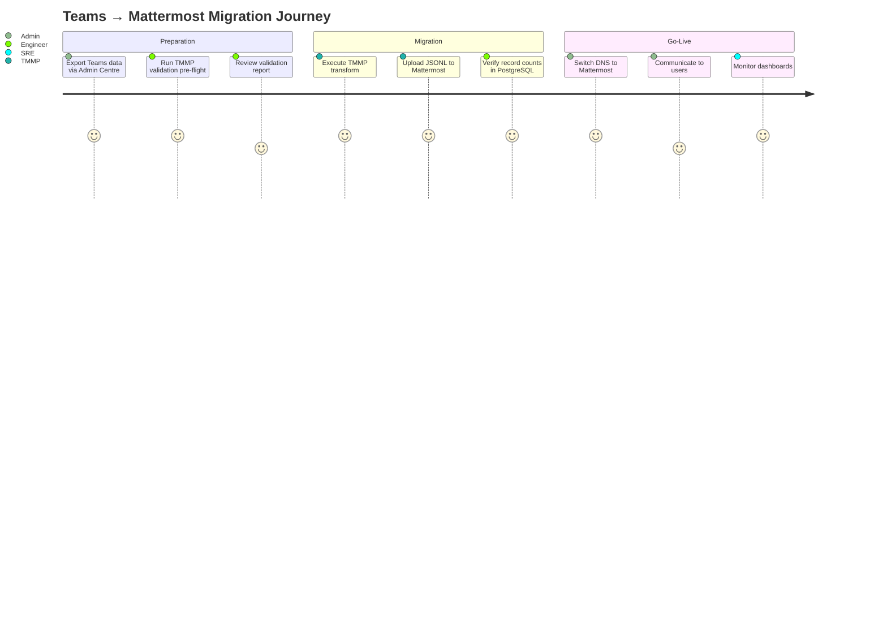
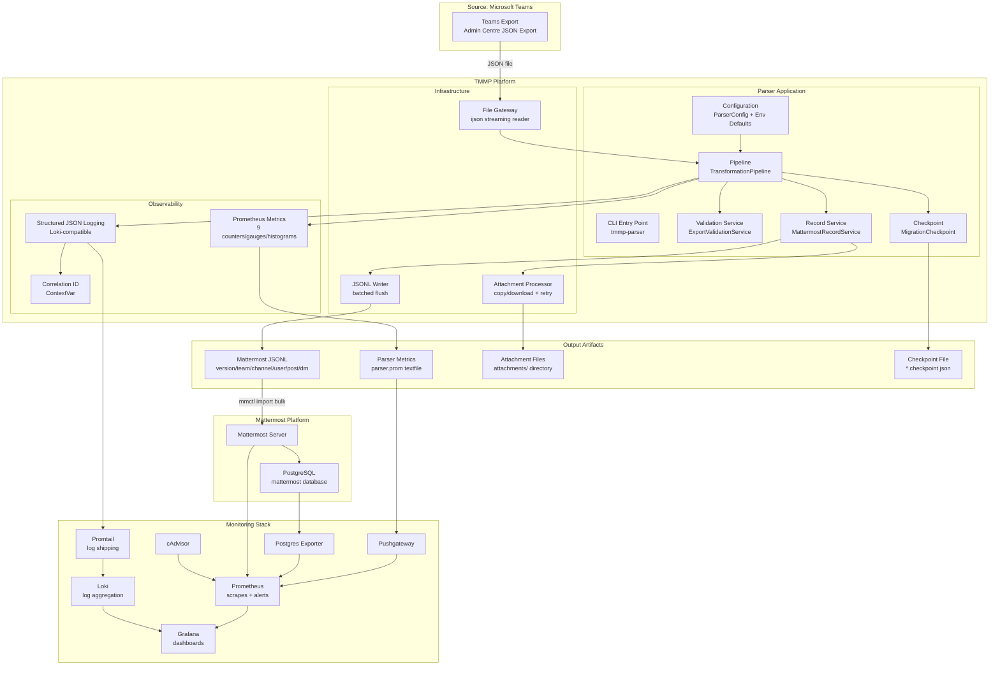
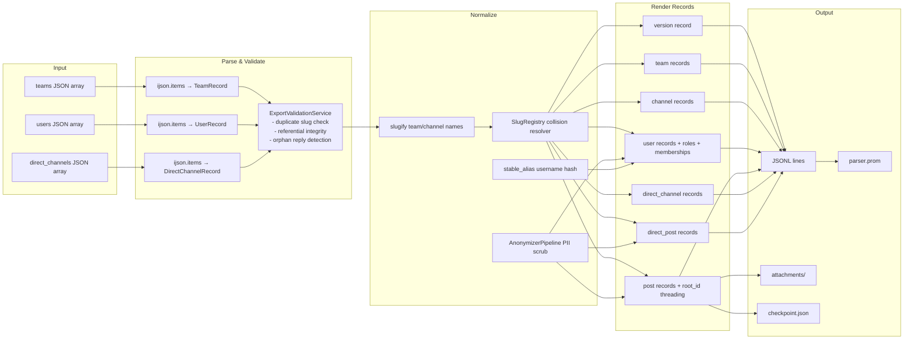
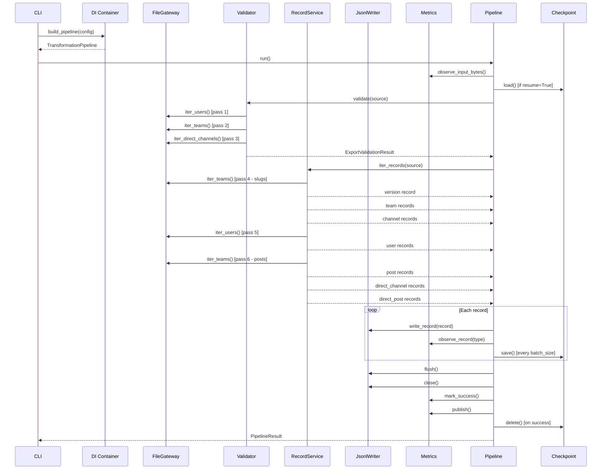
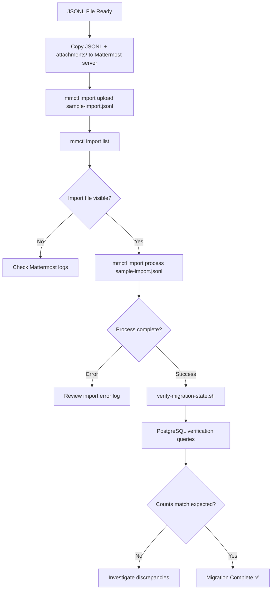
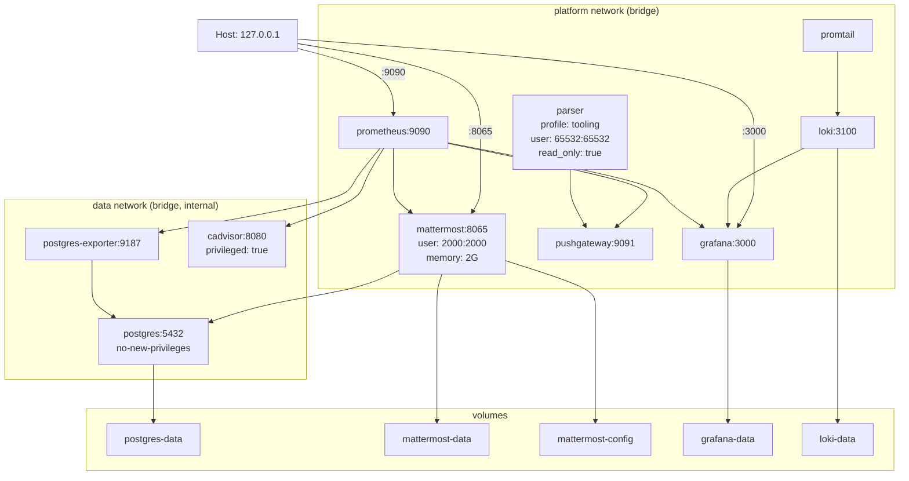
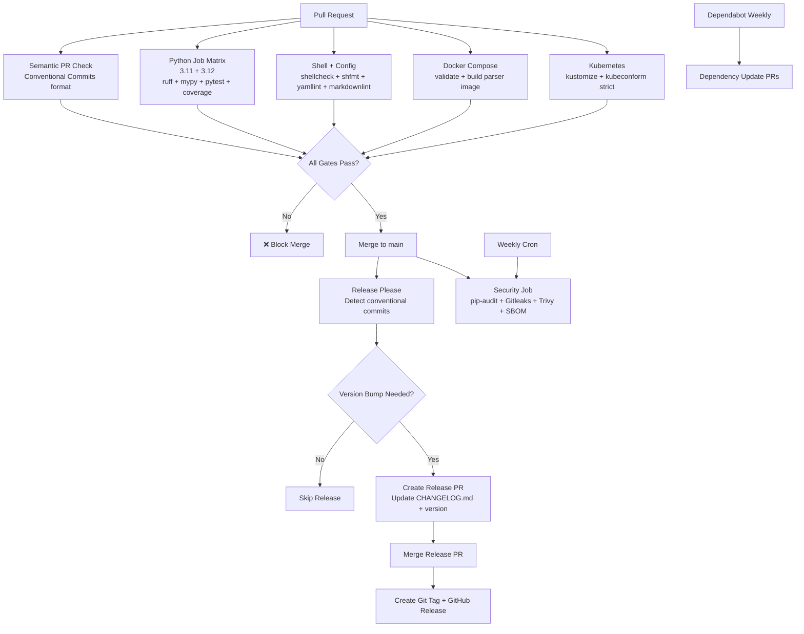
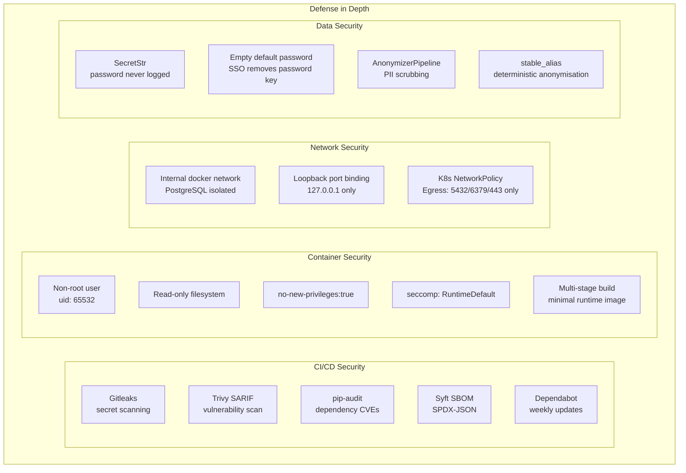
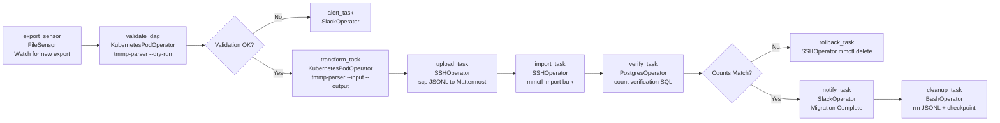

# SIR PRESENTATION
## Teams → Mattermost Migration Platform
### Senior Individual Contributor Technical Review
**Date:** 2026-06-08 | **Author:** Production Readiness Audit Team

---

## 1. Project Overview

The **Teams → Mattermost Migration Platform** (`tmmp`) is an enterprise-grade ETL (Extract, Transform, Load) system that migrates communication data from Microsoft Teams exported JSON archives into Mattermost's bulk-import JSONL format.

```
Microsoft Teams Export JSON  →  [TMMP Parser]  →  Mattermost JSONL  →  Mattermost Instance
```

The platform is built as a production-hardened Python CLI tool backed by a typed domain model, streaming infrastructure, Prometheus observability, Docker/Kubernetes deployment manifests, and a fully automated GitHub Actions CI/CD pipeline.

**Technology Stack:**
- Language: Python 3.11 / 3.12
- Core Libraries: Pydantic v2, ijson, prometheus-client, pydantic-settings
- Containerization: Docker (multi-stage), Docker Compose
- Orchestration: Kubernetes (Kustomize), K8s batch/v1 Job
- Observability: Prometheus, Grafana, Loki, Promtail
- CI/CD: GitHub Actions, Release Please, Dependabot

---

## 2. Business Problem

### The Migration Challenge

When organizations switch from Microsoft Teams to Mattermost, they face a critical business problem: **years of communication history are trapped in a proprietary format.**

Without a migration tool, organizations face:

| Option | Cost | Risk |
|--------|------|------|
| Manual re-entry | Prohibitively expensive | Data loss, no threading |
| Stay on Teams | License cost continues | Dual-platform confusion |
| Abandon history | Free | Loss of institutional knowledge, compliance risk |
| **TMMP** | **Engineering investment** | **Automated, verified, auditable** |

### Business Requirements Addressed

1. **Data Fidelity**: Every message, thread, channel, and DM must migrate intact
2. **Access Continuity**: Users arrive in Mattermost with the same channel memberships and roles they had in Teams
3. **Compliance**: PII can be scrubbed on-demand for regulated migration paths
4. **Auditability**: Every migration run is logged, metriced, and checkpointed
5. **Reliability**: Interrupted migrations can resume without data duplication

---

## 3. Real-World Use Case

### Scenario: 500-Person Engineering Organisation

```
Organisation: FinTech startup, 500 employees
Teams data: 3 years of history
Structure:   12 teams, 180 channels, 45 DM conversations
Volume:      ~2.8 million posts, 400GB attachments
Timeline:    Migrate over a maintenance weekend
```

**Migration Flow:**



---

## 4. End-to-End Architecture



---

## 5. Data Flow

### 5.1 Input Data Structures

Microsoft Teams exports contain a JSON document with three top-level arrays:

```json
{
  "users": [
    { "username": "john-doe", "email": "john@company.com",
      "nickname": "John Doe", "teams": ["engineering"] }
  ],
  "teams": [
    {
      "name": "engineering", "display_name": "Engineering",
      "channels": [
        {
          "name": "backend", "display_name": "Backend",
          "is_private": false,
          "members": ["john-doe"], "owners": ["admin"],
          "posts": [
            { "id": "msg-1", "username": "john-doe",
              "message": "Hello team!", "timestamp_ms": 1716537600000 },
            { "id": "msg-2", "username": "admin",
              "message": "Welcome!", "timestamp_ms": 1716537700000,
              "parent_id": "msg-1" }
          ]
        }
      ]
    }
  ],
  "direct_channels": [
    {
      "members": ["john-doe", "admin"],
      "posts": [...]
    }
  ]
}
```

### 5.2 Data Transformation Flow



---

## 6. Teams Export Process

The Teams export pipeline begins **outside** the TMMP platform, in the Microsoft Teams Admin Centre:

```
Admin Centre → Reports → Export → Teams Data Export
 └── Downloads as: TeamsExport_<OrgName>_<Date>.zip
      └── teams-export.json (the TMMP input)
```

The JSON schema follows the TMMP `TeamsExport` model contract. Real-world exports may contain additional fields (TMMP uses `extra="forbid"` on domain models — **this requires the export to be normalized to the TMMP schema first using a separate normalization step**).

> **Note:** TMMP assumes the input JSON has already been normalized to its schema. A real-world deployment requires a "normalize" step that maps the Microsoft export format (which differs from the TMMP schema) to the TMMP input contract. This normalization step is **not implemented** in the current repository — it is a documented prerequisite.

---

## 7. Transformation Pipeline



---

## 8. JSONL Generation

### Output Format

Each line in the JSONL file is a self-contained JSON object serialized with `sort_keys=True`:

```jsonl
{"type": "version", "version": 1}
{"team": {"description": "...", "display_name": "Engineering", "name": "engineering", "type": "O"}, "type": "team"}
{"channel": {"display_name": "Backend", "header": "Migrated from Teams: Backend", "name": "backend", "team": "engineering", "type": "O"}, "type": "channel"}
{"type": "user", "user": {"email": "john@company.com", "nickname": "John Doe", "teams": [{"channels": [{"name": "backend", "roles": ["channel_user"]}], "name": "engineering", "roles": ["team_user"]}], "username": "john-doe"}}
{"post": {"channel": "backend", "create_at": 1716537600000, "id": "post-abc123", "message": "Hello team!", "team": "engineering", "user": "john-doe"}, "type": "post"}
{"post": {"channel": "backend", "create_at": 1716537700000, "id": "post-def456", "message": "Welcome!", "root_id": "post-abc123", "team": "engineering", "user": "admin"}, "type": "post"}
{"direct_channel": {"members": ["john-doe", "admin"]}, "type": "direct_channel"}
{"direct_post": {"channel_members": ["john-doe", "admin"], "create_at": 1716537800000, "id": "direct-post-xyz", "message": "Hey!", "user": "john-doe"}, "type": "direct_post"}
```

### Key Properties
- **Record ordering:** version → teams → channels → users → posts → direct_channels → direct_posts (required by Mattermost bulk import)
- **Thread ordering:** root posts precede replies; all posts in a thread are contiguous, sorted by `root_timestamp + reply_timestamp`
- **Deterministic IDs:** SHA-1 based; same input always produces same output
- **Batch buffering:** 500 records per `write()` syscall (configurable 1–10,000)

---

## 9. Mattermost Import Process



The `apply-import.sh` script (referenced in Makefile:63) and `verify-migration-state.sh` (Makefile:66) automate steps C–K. The PostgreSQL verification queries check:
- `SELECT count(*) FROM users`
- `SELECT count(*) FROM posts`
- `SELECT count(*) FROM channels`

---

## 10. PostgreSQL Usage

PostgreSQL 15 serves as the **backing store for the Mattermost application server** — not directly used by the TMMP parser.

### Role in Migration
1. **Pre-migration:** Empty Mattermost database (or with existing data)
2. **During import:** `mmctl import bulk` writes Teams data via Mattermost's data layer (not direct SQL)
3. **Post-migration:** Verification queries confirm data integrity

### Configuration (Docker)
```yaml
postgres:
  image: postgres:${POSTGRES_IMAGE_TAG}  # 15-alpine
  command:
    - postgres
    - -c
    - max_connections=200
    - -c
    - shared_buffers=256MB
  ports: ["127.0.0.1:5432:5432"]  # Loopback only
  networks: [data]  # Internal network only
```

### Monitoring
`postgres-exporter` scrapes PostgreSQL metrics for Prometheus:
- Connection pool utilisation
- Query latency
- Database size growth during import

---

## 11. Docker Architecture



---

## 12. Monitoring Stack

### Metrics Pipeline

```
Parser run → tmmp_parser_* metrics → parser.prom textfile
          OR
Parser run → push_to_gateway() → Pushgateway:9091 → Prometheus scrape
```

### Dashboard (Grafana)

The `migration-dashboard.json` provisions a Grafana dashboard with panels for:
- Parser run status (success/failure counter)
- Records emitted per type (time series)
- Stage duration distribution (histogram)
- Attachment processing status
- Checkpoint resume count

### Alert Rules

| Alert | Expression | Severity | Action |
|-------|-----------|----------|--------|
| MattermostUnavailable | `up{job="mattermost"} == 0` for 5m | Critical | Page on-call |
| ParserRunFailure | `increase(tmmp_parser_runs_total{status="failed"}[15m]) > 0` | Warning | Notify team |
| ParserThroughputDegraded | `tmmp_parser_records_per_second < 1` for 10m | Warning | Investigate |

### Log Aggregation

```
Parser stdout → Promtail (docker container log scrape)
             → Loki (indexed by label: job, correlation_id)
             → Grafana (log explorer + dashboard panels)
```

JSON log structure:
```json
{
  "timestamp": "2026-06-08T10:30:00.000Z",
  "level": "INFO",
  "logger": "teams_mattermost_migration_parser.application.pipeline",
  "service": "teams-mattermost-migration-parser",
  "correlation_id": "a3f1b2c4d5e6f7a8",
  "message": "pipeline execution completed",
  "event": "pipeline_completed",
  "details": {
    "records_written": 25000,
    "teams": 12,
    "channels": 180,
    "users": 500,
    "posts": 2800000
  }
}
```

---

## 13. CI/CD Design



### CI Quality Gates

Every merge to `main` must pass:
1. Semantic PR title format (Conventional Commits)
2. Python lint (ruff), format (ruff), types (mypy), tests (pytest), coverage (≥ 90%)
3. Shell lint (shellcheck), format (shfmt)
4. YAML lint, Markdown lint
5. Docker Compose config validation + image build
6. Kubernetes manifest validation (kustomize + kubeconform strict)

---

## 14. Security Design



---

## 15. Airflow Integration Opportunities

While the current platform uses a CLI-triggered Kubernetes Job, it is well-positioned for integration with Apache Airflow as an orchestration layer:

### Proposed Airflow DAG



### Airflow Benefits
- **Scheduling:** Run migrations during off-hours automatically
- **Retry logic:** Airflow's retry policy complements TMMP's checkpoint/resume
- **Lineage:** Track migration runs as DAG runs with full audit trail
- **Alerting:** Native Slack/email alerting on task failure
- **Backfill:** Re-run historical migrations for specific date ranges
- **Monitoring:** Airflow UI shows task duration, status, and logs

### Implementation Pattern

```python
# airflow/dags/teams_mattermost_migration.py
transform_task = KubernetesPodOperator(
    task_id="transform_export",
    image="ghcr.io/example/teams-mattermost-parser:{{ var.value.parser_version }}",
    arguments=[
        "--input", "/workspace/exports/{{ ds }}/export.json",
        "--output", "/workspace/imports/{{ ds }}/import.jsonl",
        "--correlation-id", "{{ run_id }}",
        "--batch-size", "1000",
    ],
    env_vars={"TMMP_METRICS_PUSHGATEWAY_URL": "http://pushgateway:9091"},
    namespace="teams-mattermost-migration",
    service_account_name="parser-runner",
)
```

---

## 16. Production Deployment Strategy

### Phase 1: Validation (Day 1)

```bash
# 1. Bootstrap environment
make bootstrap

# 2. Validate export with dry-run (no output written)
tmmp-parser --input export.json --output /dev/null --fail-on-empty-export

# 3. Review validation logs for data quality issues
# Look for: "unknown parent", "missing from users", "unknown teams"
```

### Phase 2: Staging Migration (Day 2–3)

```bash
# 1. Stand up staging Mattermost
kubectl apply -k infrastructure/kubernetes/overlays/staging

# 2. Run transform (will write JSONL + checkpoint)
kubectl apply -f staging-parser-job.yaml

# 3. Monitor progress
kubectl logs -f job/parser-job -n teams-mattermost-migration

# 4. Upload and import
mmctl import upload artifacts/imports/import.jsonl
mmctl import process import.jsonl

# 5. Verify counts match expected
make verify
```

### Phase 3: Production Migration (Maintenance Window)

```
T-72h:  Send user communication about maintenance window
T-24h:  Freeze Teams usage (read-only mode if possible)
T-6h:   Export Teams data
T-5h:   Run TMMP validation
T-4h:   Run TMMP transform
T-2h:   Upload JSONL to production Mattermost
T-1h:   Run mmctl import bulk
T-0:    Run verification queries; DNS cutover
T+1h:   Monitor Grafana dashboards; verify user reports
T+24h:  Delete JSONL artifacts (chmod 600 applied; sensitive)
```

### Rollback Plan

If Mattermost import fails partway through:
1. `mmctl import delete <import-id>` — removes partially imported data
2. Restore from Mattermost backup (pre-migration snapshot)
3. Diagnose TMMP output (check checkpoint file for progress)
4. Fix source data or TMMP config
5. Re-run with `--resume` flag (checkpoint resumes from last completed batch)

---

## 17. Current Limitations

| Limitation | Impact | Workaround |
|-----------|--------|------------|
| No Teams-to-TMMP normalization step | Must pre-process Teams export to match TMMP schema | Documented prerequisite |
| 6 file reads per pipeline run | Slow on NFS/remote storage | Use local disk |
| Sequential attachment downloads | Slow for large attachment sets | Pre-copy attachments locally |
| No JSONL chunking for >10GB | Potential Mattermost import failure | Manual split with `split` command |
| No OTEL distributed tracing | Cannot trace individual post rendering | Use correlation_id in Loki |
| Non-atomic checkpoint writes | Checkpoint corruption on power failure | Monitor with healthcheck + retry |
| SHA-1 for import IDs | Theoretically deprecated | Low risk; only used for key derivation |
| SCRUB_KEYWORDS hardcoded | Cannot add org-specific sensitive terms | Requires code change + redeploy |

---

## 18. Future Roadmap

### Near-Term (Q3 2026)

1. **Teams Schema Normalizer** — Implement the missing normalization adapter that maps real Microsoft Teams export format to TMMP's input schema
2. **Atomic Checkpoint Writes** — `tempfile` + `os.replace()` pattern
3. **JSONL Chunking** — `--max-chunk-mb` flag for automatic split at configurable byte threshold
4. **Asyncio Attachment Downloads** — 10-concurrent bounded `asyncio.gather` for 10× attachment throughput

### Medium-Term (Q4 2026)

5. **OpenTelemetry Integration** — Wire `otel_service_name` to actual OTEL SDK span exporter (Jaeger/Tempo)
6. **Airflow DAG** — Production-ready Airflow integration with KubernetesPodOperator
7. **Single-Pass Architecture** — Rewrite pipeline as single `ijson` scan with concurrent validator + renderer
8. **Configurable SCRUB_KEYWORDS** — `TMMP_SCRUB_KEYWORDS` env var support
9. **HMAC-based stable_alias** — Per-migration secret key for stronger anonymisation
10. **Container Image Publish Pipeline** — GHCR push on successful CI + version tag

### Long-Term (H1 2027)

11. **Slack Import Adapter** — Extend domain model to support Slack export as alternative source
12. **Real-time Migration Mode** — Incremental migration with Delta detection for zero-downtime cutover
13. **Web UI** — Browser-based migration wizard with progress tracking
14. **Compliance Report Generator** — Automated GDPR/CCPA compliance evidence report for regulated migrations

---

## 19. Final Scorecard

```
╔═══════════════════════════════════════════════╗
║          PLATFORM SCORECARD                   ║
╠══════════════════════╦════════╦═══════════════╣
║ Dimension            ║ Score  ║ Key Evidence  ║
╠══════════════════════╬════════╬═══════════════╣
║ Functionality        ║  9/10  ║ 28/28 tests   ║
║ Reliability          ║  7/10  ║ checkpoint ok ║
║ Scalability          ║  7/10  ║ ijson stream  ║
║ Security             ║  8/10  ║ pip-audit ✅  ║
║ Maintainability      ║  8/10  ║ mypy strict   ║
║ Observability        ║  7/10  ║ 9 metrics     ║
║ Test Coverage        ║  9/10  ║ 90.03%        ║
║ Production Readiness ║  7/10  ║ conditional   ║
╠══════════════════════╬════════╬═══════════════╣
║ TOTAL                ║ 62/80  ║ 77.5%         ║
╚══════════════════════╩════════╩═══════════════╝

VERDICT: CONDITIONALLY PRODUCTION READY
- Safe for standard enterprise migrations TODAY
- 3 security items before regulated/cloud migrations
- Strong foundation; clear roadmap to 90%+ score
```
