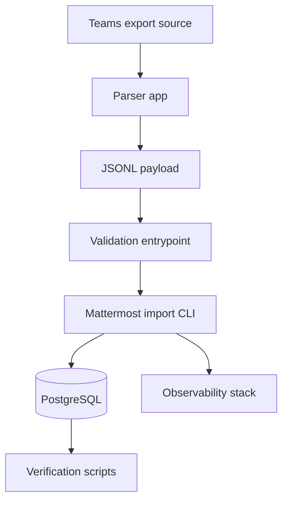

# Architecture Overview

The platform is organized around a small control plane:

- a typed parser application that converts normalized Teams exports into Mattermost JSONL
- Docker Compose manifests for local platform services and the observability
  stack
- shell entrypoints for bootstrap, migration, verification, cleanup, and
  monitoring
- Kubernetes scaffolding for future batch execution of parser jobs

## Logical components

## Design choices

- The parser is isolated under `apps/parser/` so it can evolve independently
  into a worker image or queue consumer.
- Local operations use shell scripts with a shared library rather than one
  large script.
- Docker Compose keeps the developer workflow lightweight while the Kubernetes
  overlay documents how batch execution would look in a cluster.
- Monitoring configuration lives under `infrastructure/monitoring/` so
  dashboards and scrape configs can be versioned alongside platform code.
